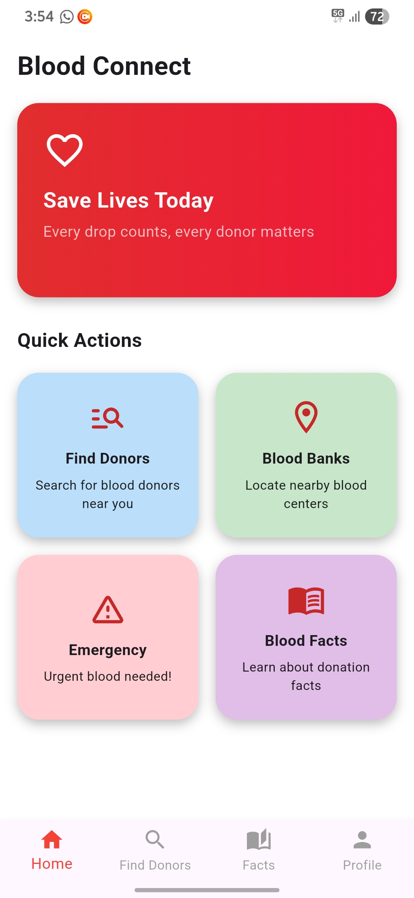
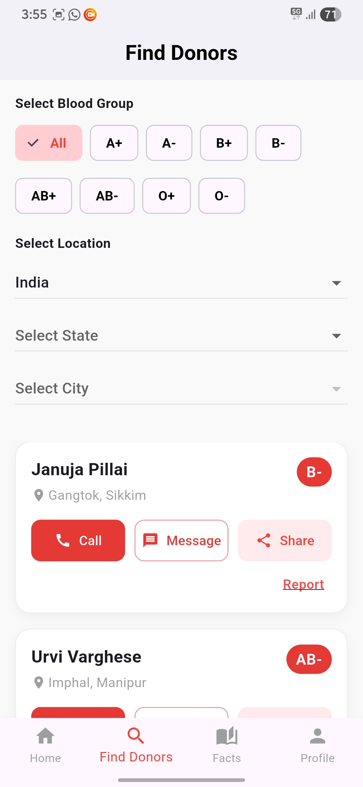
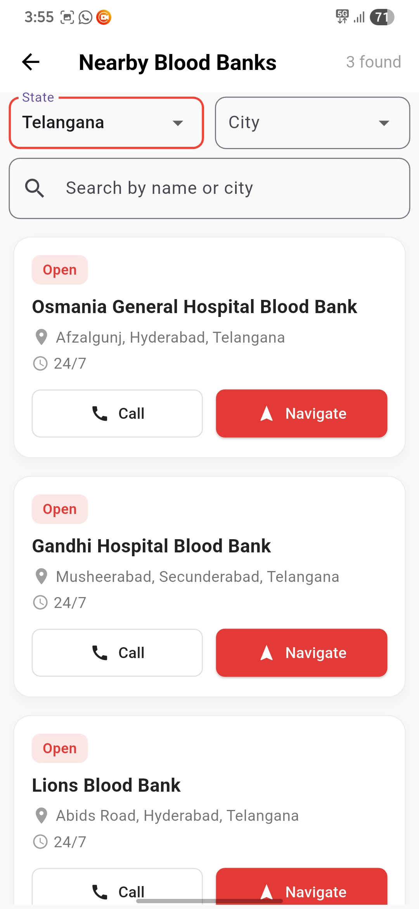

<p align="center">
  <a href="https://github.com/siripulusu/blood_donation_app/stargazers">
    
  </a>
  <a href="https://github.com/siripulusu/blood_donation_app/network/members">
    
  </a>
  <a href="LICENSE">
    
  </a>
</p>

---
# 🩸 Blood Connect

> _"Connecting Lives, One Drop at a Time"_

Blood Connect is a **Flutter-based blood donation platform** designed to bridge the gap between donors and recipients in real-time. It integrates Firebase for authentication, database, and storage, ensuring a smooth and secure experience.

---


## 📋 Features
### 🔍 Donor Search
- Find registered blood donors by **blood group**, **state**, and **city**.
- Search bar for quick donor lookup.
- Direct actions: **Call**, **SMS**, **Share**, and **Report** from donor cards.

### 👤 Donor Registration
- Email/Password authentication via Firebase.
- Guided onboarding for new donors:
  1. Sign In or Register via Email.
  2. Complete donor profile form.
  3. Data securely stored in **Firestore**.
- My Profile section for viewing registered details.

### 🏥 Blood Banks
- List of blood banks with **state & city filters**.
- Blood bank cards with:
  - Name, Address, 24/7 status badge.
  - **Call** and **Navigate** buttons with maps integration.
- Data fetched from Firestore `blood_banks` collection.

### 🚨 Emergency Requests
- Authenticated users can post urgent blood requests.
- Fields: Patient Name, Blood Group, Hospital, Location, Contact Info.
- Stored in `emergency_requests` Firestore collection.

### 📚 Blood Facts
- Scrollable, animated facts loaded from local JSON.
- Engaging presentation with Lottie animations.

---

## 🛠 Tech Stack
- **Frontend:** Flutter (Dart)
- **Backend:** Firebase
  - **Authentication:** Firebase Auth (Email/Password)
  - **Database:** Cloud Firestore
  - **Storage:** Firebase Storage (for images, if needed)
- **UI:** Material Design, Neumorphic Cards, Animations, Lottie
---
## 📂 Firebase Firestore Structure

```plaintext
donors (collection)
 └── donor_id (document)
      ├── name: string
      ├── email: string
      ├── blood_group: string
      ├── phone: string
      ├── state: string
      ├── city: string
      ├── last_donation_date: timestamp
      └── user_id: string

blood_banks (collection)
 └── bank_id (document)
      ├── name: string
      ├── address: string
      ├── city: string
      ├── state: string
      ├── phone: string
      ├── latitude: number
      └── longitude: number

emergency_requests (collection)
 └── request_id (document)
      ├── patient_name: string
      ├── blood_group: string
      ├── hospital: string
      ├── location: string
      ├── contact: string
      ├── created_at: timestamp
      └── user_id: string
```
---


## 🛠 How It Works

<table>
<tr>
<td align="center" width="33%">
  
  <br>
  <em>1️⃣ Home – Quick access to donor search, blood banks, and recent activity.</em>
</td>
<td align="center" width="33%">
  
  <br>
  <em>2️⃣ Donor Search – Find donors by blood group, location, and availability.</em>
</td>
<td align="center" width="33%">
  
  <br>
  <em>3️⃣ Blood Banks – Browse nearby blood banks and check available stock.</em>
</td>
</tr>
</table>


---

## 🚀 Getting Started

### Prerequisites
- [Flutter SDK](https://docs.flutter.dev/get-started/install)
- [Firebase Project](https://firebase.google.com/) set up
- Google Maps API Key

### 📦 Installation

```bash
# 1️⃣ Clone the repository
git clone https://github.com/yourusername/blood_connect.git
cd blood_connect

# 2️⃣ Install dependencies
flutter pub get

# 3️⃣ Setup Firebase
# - Enable Email/Password Auth
# - Create Firestore collections
# - Add google-services.json (Android) & GoogleService-Info.plist (iOS)

# 4️⃣ Run the app
flutter run
```

---

## 📜 License
This project is licensed under the **MIT License**.  
See the [LICENSE](LICENSE) file for more information.

---

## ❤️ Acknowledgements
- **Flutter** & **Dart** teams
- **Firebase** for backend infrastructure
- All donors and volunteers making a difference

---

> _"Your blood can save a life. Join the movement with Blood Connect."_ 🩸

